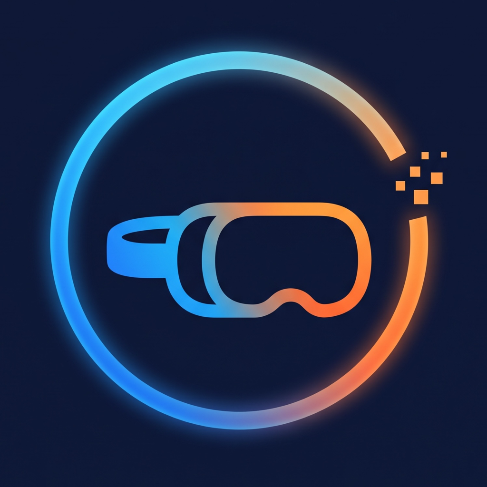

<p align="center">
  
</p>

# Frameloader

[www.frameloader.com](https://www.frameloader.com)

Drop an (unbundled) APK, a Windows app, or a Linux ARM64 build onto Frameloader and it shows up in your Steam Frame's library, under Non-Steam, ready to launch.

Open source, cross-platform (macOS, Windows, Linux), and built on the same mechanism Valve's own SteamOS Devkit Client uses.

## How it works

Frameloader uses the **SteamOS devkit protocol** to install your APK or other app as if it was one you had developed:

1. **Pairing.** When you turn on dev mode, the headset runs a small pairing service on port 32000. Frameloader generates an RSA key, posts it to `/register`, and you approve the request on the headset by clicking "Pair new host" (Settings → Developer → Pair new host). Then Frameloader can use its RSA key to log in over SSH to upload apps. (You can also connect with the Developer Mode password instead.)
2. **Upload.** Valve's device-side helper scripts (`devkit-utils`, copied into `vendor/devkit-utils` because they don't seem to publish it on NPM) are copied to `~/devkit-utils` on the headset. `steamos-prepare-upload` creates `~/devkit-game/<id>/`, and your files are copied there over SFTP.
3. **Register.** `steam-client-create-shortcut` tells the running Steam client about the title and which runtime to use. The frame-side code then adds "Devkit Game: <id>" to your library live. Frameloader then reaches over and renames it to drop the Devkit Game prefix.
4. **Launch.** Frameloader calls `steam-devkit-rpc run-game` to start it, or you pick it from the headset's library.

| You drop | Runtime (Steam compat tool) | Status |
|---|---|---|
| `.apk` (arm64-v8a, API ≤ 30) | Lepton | Primary path. Each app runs in its own persistent Lepton container, so save data survives. |
| Windows `.exe` or a zip/folder with one | Proton Experimental or Proton (stable) | Works through FEX. Needs a Proton already installed on the headset. |
| Linux ARM64 build | Steam Linux Runtime 4 (ARM64) | Starts natively; self-contained builds only. |
| Linux x86-64 build | – | Refused: the Frame won't install the x86-64 runtime for sideloaded titles. |
| `.apkm` (bundled APKs) | – | Refused: Lepton can only handle an individual APK binary right now, I think? |

For Android apps, Frameloader reads the manifest to pick a name and icon, refuses 32-bit-only and too-new APKs, and writes Lepton's `lepton-show-flatscreen` marker for non-VR apps so they're actually visible. OBB files dropped with an APK go into `obb/` next to it.

## Using it

1. On the headset: Steam Settings → System → **Enable Developer Mode**. (I'd also recommend doing Settings → Developer → **Set User Password** for security if you're doing this.)
2. Open Frameloader. Headsets with Developer Mode on show up under "Found on your network" (they advertise Valve's devkit service over mDNS); click one, or type a hostname or IP. Click **Pair with headset** in Frameloader. On your Frame, open Settings → Developer → **Pair new host** and approve.
3. Drop a file. Check the name, pick a runtime if there's a choice, click **Install to Frame**.

## Development

This is a pnpm workspace:

| Path | What it is |
|---|---|
| `apps/desktop` | The Electron app (TypeScript, esbuild, electron-builder) |
| `apps/web` | The website (plain HTML and CSS, built with Vite) |
| `packages/tokens` | Shared color, type and shape tokens used by both |

```bash
pnpm install
pnpm start          # build and run the desktop app
pnpm dev:web        # website dev server on http://localhost:5180
pnpm typecheck
pnpm test
pnpm build:web      # static site in apps/web/dist
pnpm dist:mac       # or dist:win / dist:linux
```

The desktop app bundles all of its runtime dependencies into `dist/main.cjs`, so packages contain no `node_modules`.

The renderer can be previewed in a normal browser with simulated data: serve `apps/desktop/dist/` and open `index.html?mock=connected` (also `fresh`, `empty`, `offline`, `nolepton`, `fail`). `pnpm --filter frameloader-desktop screenshots` regenerates the website's screenshots from that mock, in light and dark.

`pnpm install` must be allowed to run the `electron` and `esbuild` build scripts (see `pnpm-workspace.yaml`). If Electron's binary is missing, run `node node_modules/electron/install.js`.

## Agent use

This app is heavily agent-coded, but the expectation is that architectural decisions should be human-made and code should be human-reviewed. We're dealing with system-level access, so we should be cautious about Agentic hallucinations or missed cases.

## Privacy

Frameloader has no analytics, telemetry, crash reporting or accounts. It connects to your headset on your local network: SSH, Valve's devkit pairing service on port 32000, and mDNS discovery. The only other request is an update check: twice a day it asks GitHub's public releases API for the latest version number. It never downloads anything, and Settings → Updates turns it off if you want a truly LAN-only setup. Any remembered passwords should be encrypted with the operating system's secure storage.

## Builds and releases

Every push to `main` and every pull request runs `.github/workflows/build.yml`: typecheck, tests, the website build, then installers for macOS (arm64 and x64), Windows x64, and Linux x64 and arm64. The installers are attached to the run as artifacts.

To ship a release you must be an Admin:

1. On GitHub, go to **Releases → Draft a new release**.
2. Create a new tag named `vX.Y.Z` (for example `v0.1.0`) targeting `main`, write the notes (or use **Generate release notes**), and publish.
3. Publishing runs `.github/workflows/release.yml`, which builds that tag stamped as version `X.Y.Z` and attaches the installers to the release. It takes a few minutes. If it fails, re-run the workflow; uploads replace any partial ones.
4. The release step will attempt to sign the mac release before attaching it to the public release (to avoid the security blocks Apple requires on all Mac systems after 15 or 16 - somewhere in there). This step requires an org admin's approval because it uses the org's secret keys read from the environment. It will hang until you contact Zack.

The version in `apps/desktop/package.json` is only what local and CI builds report; releases take their version from the tag at build time.

Installed apps notice new releases on their own: they check GitHub's releases API and show a banner with a link once a release has its installers attached. Nothing is downloaded or installed automatically, and Settings → Updates turns the check off.

## Website hosting (Cloudflare Workers)

www.frameloader.com is a Cloudflare Worker that serves `apps/web/dist` as static assets, deployed by Workers Builds on every push to `main`. The Worker is defined in `wrangler.jsonc` at the repo root; headers live in `apps/web/public/_headers`.

Workers Builds settings (Worker → Settings → Build):

| Setting | Value |
|---|---|
| Root directory | `/` |
| Build command | `pnpm install --frozen-lockfile --filter "frameloader-web..." && pnpm build:web` |
| Deploy command | `pnpm exec wrangler deploy` |
| Preview command | `pnpm exec wrangler preview` |
| Build variables | `PNPM_VERSION=11.24.0`, `SKIP_DEPENDENCY_INSTALL=1`, `ELECTRON_SKIP_BINARY_DOWNLOAD=1` |

Locally: `pnpm preview:web` runs the built site in the Workers runtime, and `pnpm deploy:web` deploys by hand using your local wrangler auth.

## Troubleshooting

- **"Couldn't find frame.local."** Frameloader resolves names itself over mDNS, then the OS resolver, then by browsing for the devkit service, then the last known IP. If all fail: the Frame is asleep (it drops off the network), Developer Mode is off, or the network blocks multicast (guest/isolated Wi-Fi). Typing the IP from Quick Settings always works.
- **Pairing says the headset didn't answer.** Steam must be sitting on the Pair new host screen while Frameloader asks.
- **"Steam isn't running on the headset."** Registration needs the Steam client up; put the headset on or wake it and try again.
- **Logs.** Settings → Developer tools adds a Logs tab for Android titles and an activity log of every command sent to the headset.
- **A 2D Android app launches but nothing shows.** Reinstall with "Show a 2D window" on (Advanced).
- **Lepton missing.** Click Install next to the Lepton chip (it asks Steam to install app 3056000); confirm on the headset.
- **Compat tool alias.** Valve's current scripts expect `lepton`. If your firmware wants a different name (older builds used `fauxdroid`), add `"compatToolOverrides": {"lepton": "lepton-stable"}` to Frameloader's `config.json` in its user-data folder.

## Credits

- Valve's [SteamOS Devkit Client](https://gitlab.steamos.cloud/devkit/steamos-devkit) (MIT) for the device-side scripts and the protocol.
- [Lepton](https://gitlab.steamos.cloud/frame-public/lepton) (MIT) for documenting how Android titles are launched.
- [Frame Control](https://github.com/saphid/frame-control) (MIT) for field notes that verified each runtime on real hardware.

MIT licensed, provided as is with no warranty; see the [terms of use](https://www.frameloader.com/terms). If Frameloader saves you some time, you can [buy me a coffee](https://buymeacoffee.com/travelerdev).
